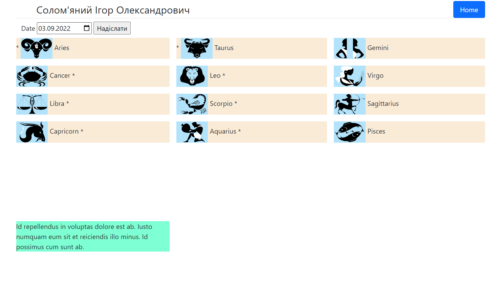

##Задача

Создание страницы на которой будут присутствовать логотипы 12 знаков зодиака
При клике на лого подтягивается текстовое предсказание. 
Предсказание на каждый день является уникальным для знака зодиака, 
и не имеет пересечение с другими знаками зодиака в конкретную дату. 

При первом открытии предсказания для знака зодиака, оно уже не меняется в этот календарный день. 

и написать реализацию для их вывода на страницу. 
Красивым оформлением в плане вёрстки можно пренебречь

#### Question: Нужно предложить реализацию для загрузки 300 предсказаний:
#### Answer: 
###### (Якщо мова про опитимізацію)
Завантажуємо передбачення на сьогодні, зберігаємо у кеші по дням.

###### (Якщо мова про отримання)
1. Написати вручно, або замовити.
2. Парсінг з інших сайтів + перекладач для видозміни тексту.
3. Шаблонний конструктор.

### Результат 

###### Маркери Передбачень:
Щойно завантежене
`.circle_div.new::after {content: '*'}`

Завантажене з HTML
`.circle_div.old::before {content: '*'}` 

SQL запит для отримання нового передбачення:

`select predictions.* 
from predictions 
left join daily_predictions 
    on predictions.id = daily_predictions.prediction_id 
where predictions.id not in (?) 
    and (
        daily_predictions.horoscope_id != ? 
        or daily_predictions.horoscope_id is null
    ) 
group by predictions.id 
order by RAND();`
